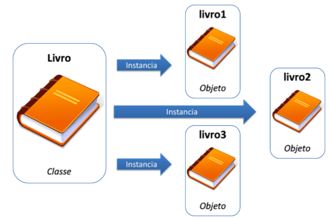
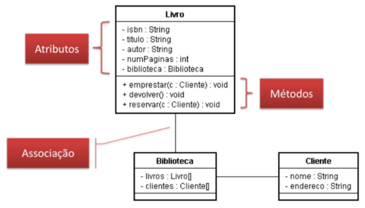
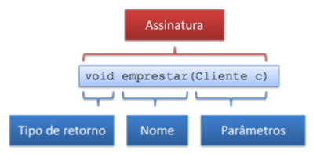
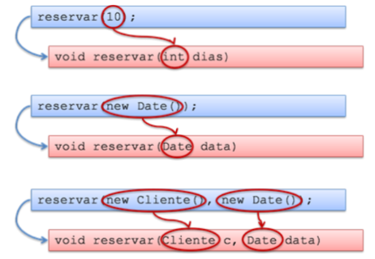
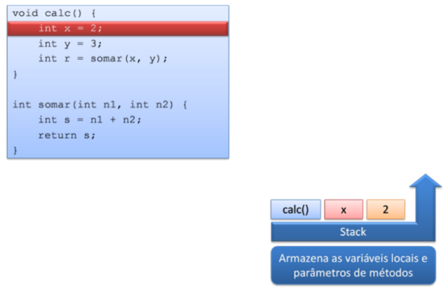
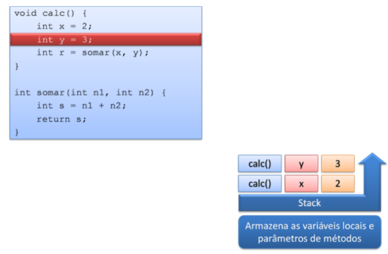
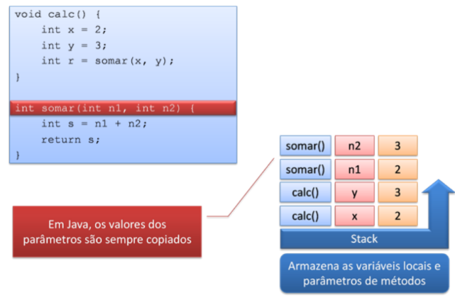
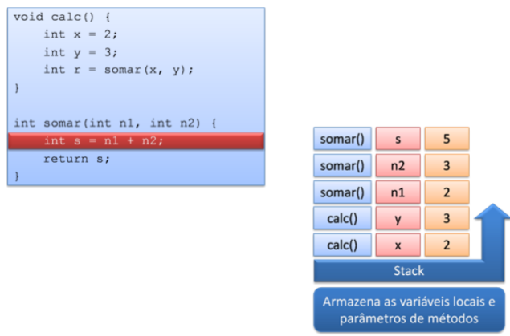
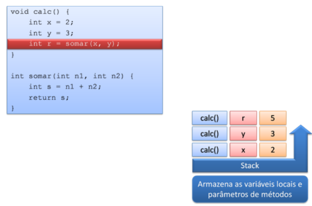
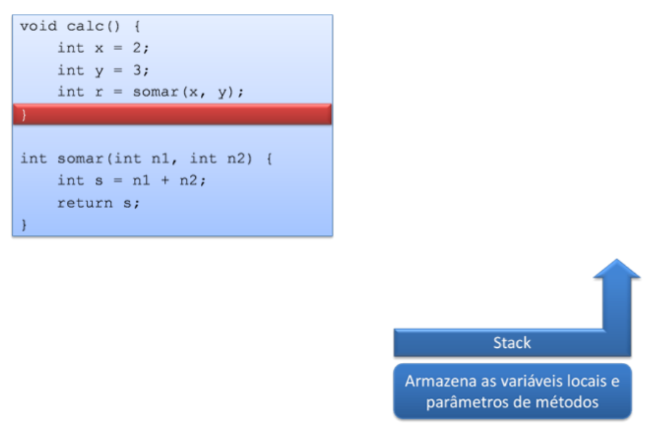

# Curso de Fundamentos de Java 

## Classes e objetos

### 1. Programação procedural

1. Orientada a procedimentos ou funções;

#### 1.1 Problemas:
- Mudanças de requisitos;
- Problema em mexer em código que está pronto. Sempre há riscos de introdução de novos bugs;
- Mudança de desenvolvedor. Necessidade de conhecimento profundo do códigos dos novos desenvolvedores;
- Muitas pessoas responsáveis por colocar o mesmo código em vários lugares. Possibilidade de esquecimento de alteração em determinada parte do código é grande; 

### 2. Orientação a objetos

- Escever menos código -> reutilização de código;
- Concentrar responsabilidades nos locais certos;
- Flexibilização da aplicação;
- Encapsular lógica de negócio;
- Polimorfismo (variação do comportamento);

#### 2.1 Classes

- Uma *classe* representa um tipo de dados;
- É uma estrutura;
- O programador define os elementos que a classe terá.
- *Atributos* são as coisas que uma classe tem. São características da estrutura (classe). São características que a classe sabe sobre si mesma;
- *Métodos* são operações que se podem realizar na classe.
- *Atributos* são representados por substantivos.
- *Métodos* são operações que a classe é capaz de realizar. Representa-se por verbos.

#### 2.2 Objetos

- A *classe* é apenas uma estrutura;
- Os *objetos* é o que se cria a partir de uma estrutura;
- Podem ser criados quando objetos quantos se queiram a partir das classes;
- Classes são utilizadas para instanciar objetos. 

Exemplo abaixo:



Cada objeto acima é diferente entre si. Tem atributos diferentes. Mas são criados com base na classe livro.

#### 2.3 Declarando classes no Java

- No java, classe são declaradas utlizando a palavra reservada *class*:


```java
public class livro {
...
}

```
- Um arquivo *.java* pode ter apenas uma classe declarada como pública dentro dele. O nome do arquivo java é o nome da classe. 

#### 2.4 Declarando Métodos e Atributos

- Atributos definidos como se definem variáveis.
- No exemplo abaixo são criados dois atributos: *isbn* e *numPaginas*;
- Abaixo são declarados dois métodos.
- O java inicializa os atributos automaticamente. O Java atribui valores padrão para os valores. Para variáveis numéricos atribui o valor 0 e para o *boolean*, por exemplo, atribui o valor *false*.


```java
public class livro {

//atributos 
String isbn;
int numPaginas;
...

	//métodos
	void emprestar (Cliente c){
	...
	}
	void devolver (){
	...
	}
}

```

#### 2.5 Notação UML

- **U**nified **M**odeling **L**anguage;
- A notação UML é utilizada para documentar sistemas orientados a objetos;
- Composta por diversos diagramas, entre eles o **Diagrama de Classes**, que mostra as classe do sistema, em conjunto com respectivos métodos e atributos.

Abaixo um exemplo de Diagrama de Classes:



Os quadrados são divididos em 03 partes:

- Nome da Classe, atributos e métodos.
- Os atributos estar associados a outras classes. Há a relação entre duas classes.


#### 2.6 Assinatura de um método

- Declara-se o tipo de retorno, depois o nome e em seguida os parâmetros do método. 



- Se o método não retorna valores, é utilizada  a palavra *void*.
- Um método pode ter zero ou mais parâmetros, e todo parâmetro deve ter um tipo definido.

#### 2.7 Sobrecarga de Métodos

- Sobrecarregar um método quer dizer criar métodos com mesmo nome, mas com assinatura diferente. Exemplo abaixo:

```java
void reservar (int dias)

int reservar (Date data)

void reservar (Cliente c, Date data)

```
- Três métodos com mesmo nome, que não são extamente iguais.
- O nome do método não muda;
- Os parâmetros variam. Variam de acordo com tipos diferentes e quantidade de parâmetros solicitados pelo método.
- O importante é que exista diferença e não haja dois métodos com a mesma assinatura.
- No caso de vários métodos com o mesmo nome, o Java identifica os parâmetros que estão sendo passados. 



#### 2.8 Criando e Manipulando Objetos

- O objeto é sempre uma instância de uma classe;
- Para instanciar objetos é utilizada a palavra _new_;

```java
Livro livro01 = new Livro();
Cliente cliente1 = new Cliente();

```

- Acima estão sendo criados objetos associados a variáveis _livro01_ e _cliente1_;
- O objeto possui acesso ao que foi definido na sua estrutura (classe) através do  operado ".", como abaixo:


```java
livro1.titulo = "Aprendendo Java";
livro1.emprestar(cliente1);
```

- Cada objeto criado com o _new_ é único;
- Os atributos de objetos diferentes pertencem apenas ao objeto;

```java
Livro livro1 = new Livro();
livro1.isbn = "1234";

Livro livro2 = new Livro();
livro2.isbn = "4321";
```

- Na memória são dois objetos diferentes. Cada livro possui o seu próprio ISBN, por exemplo. 


#### 2.9 Objetos e Referências

- Uma variável cujo tipo é uma classe não guarda o objeto diretamente;
- A variável gurda uma referência ao objeto;
- O _new_ aloca uma área de memória e retorna a referência (endereço) da área de memória alocada;
- As variáveis declaradas em métodos são criadas numa área de memória chamada **stack**.
- Os objetos são criados numa área de memória chamada de **heap**;

##### 2.9.1 Como funciona a Stack

- A stack é uma área de memória que armazena as variáveis locais e parâmetros de métodos;
- A stack é como que uma pilha;

```java
void calc(){
	int x = 2;
	int y = 3;
	int r = somar(x,y);
}

int somar (int n1, int n2){
	int s = n1 + n2;
	return s;
}
```

```java
	int x = 2;

```



```java
	int y = 3;

```



```java
int somar (int n1, int n2){...
```



```java
	int s = n1 + n2;
```



```java
	int r = somar(x,y);
```


- Quando o método termina, tudo o que foi declarado na stack com relação aquele método é eliminado dela automaticamente pelo Java.



##### 2.9.2 Como funciona o Heap


