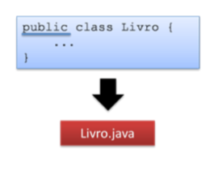
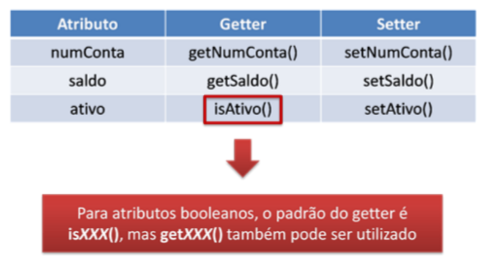
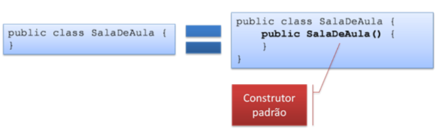
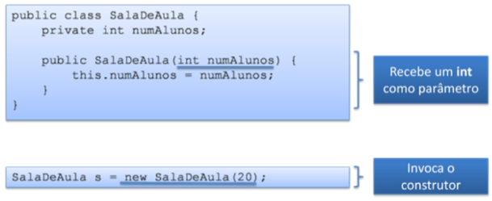
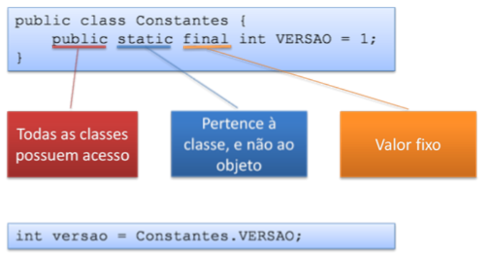

# Curso de Fundamentos de Java .

## Modificadores de Acesso, Construtores e Elementos Estáticos

### 1. Modificadores de acesso

- Restringem o acesso aos elementos de uma classe, como atributos e métodos;
- Alguns modificadores:
1. _private_: visivel apenas para a classe que o declara;
2. _public_: elemento visível a todas as classes;

#### 1.1 Atributos e métodos
 
- Marcar um atributo ou método como _private_ esconde o atributo de quem usa a classe. 
- É interessante marcar métodos como _private_ quando este método é auxiliar da classe, e que não deve estar acessível externamente. 


```java
class Livro{
	private String isbn;
	private int numPaginas;
	
	public void emprestar(Cliente c){
	...
	}
	public void devolver() {
	...
	} 
```
 - Os atributos acima são acessíveis somente pela classe livro, que os enxerga.
 - Os métodos acima são públicos, ou seja, qualquer outra classe consegue enxergar esses métodos;
 - Não é regra mas atributos são, normalmente, declarados como _private_ e métodos são declarados como _public_.
 - O ideal é que objetos colaborem através de trocas de mensagens, ou sejam chamadas de métodos, e não através de manipulação direta de atributos. 
 - Os atributos não são expostos externamente, somente os métodos. Isso protege os atributos.
 
#### 1.2 Classes

- Quase sempre classe também são declaradas como _public_;
- Apenas uma classe definidad como _public_ pode existir num arquivo Java;
- O nome do arquivo deve ser igual ao nome da classe definida como _public_, conforme abaixo:



- Classe não declaradas como _public_ são chamadas _inner classes_, incluindo classes declaradas dentro de outras classes;

### 2. Princípio do Encapsulamento

- Encapsular é esconder detalhes de funcionamento do programa; 
- É fundamental para permitir que o programa seja suscetível a mudanças.

#### 2.1 Métodos Getters e Setters

- Quando os atributos são declarados como _private_, externamente eles não podem ser acessados. Nesse caso se utiliza os métodos _getters e setters_;
- Os getters são usados para expor os valores de atributos;
- Os setters são usados para alterar os valores de atributos. 


##### 2.1.1 Benefícios dos métodos getters e setters

- Protegem os atributos;
- Evitam mudanças de códigos em diversos lugares;
- Não utilizar getters e setters quando não for necessário;
- Permitem validação na entrada de dados;

##### 2.1.2 Assinatura dos métodos getters e setters

- A assinatura dos getters e setters segue um padrão:
- Get ou set concatenado com o nome do atributo como nome do método;
- A primeira letra do atributo fica maiúscula;
- No caso de atributos tipo boolean, o padrão do getter é _is..._, porém o get também pode ser utilizado.



### 3. Construtores

- O construtor de uma classe é chamado toda vez que um objeto da classe é instanciado;
- No momento da instanciação do objeto, se for necessário executar determinado código, esse código deve ser colocado dentro do construtor;
- O construtor possui o mesmo nome da classe;
- logo após da instanciação do objeto o construtor é chamado.
- O construtores ainda podem: validar parâmetros, podem chamar outros métodos, instanciar outros objetos etc.


#### 3.1 Construtor Padrão

- Quando o construtor não é fornecido, o Java fornece um construtor padrão (sem parâmetros);
- Toda classe deve ter um construtor, por isso o Java fornece um construtor padrão, se não for descrito um.
- A partir do momento em que se define um construtor, o construtor padrão (sem parâmetros) não está mais disponível. Ele terá que ser definido manualmente. 



#### 3.2 Construtor com parâmetros

- Construtores podem receber parâmetros da mesma forma que métodos.
- Os parâmetros são passados no momento em que o _new_ é executado.



#### 3.3 Sobrecarga de Construtores

- Dois cosntrutores na mesma classe que recebem parâmetros diferentes;
- Java diferencia pelo parâmetros passados quando o _new_ é executado;
- O _this()_ é uma forma que existe de invocar um outro construtor a partir de um construtor.
- Em _this()_ pode ser passado parâmetros para o outro construtor, se for necessário.


### 4. Atributos e Métodos Estáticos 

- Atributos e/ou métodos podem não estar atrelados a um objeto específico, mas sim à classe;
- Esse atributos e métodos da classe são definidos pelo modificador _static_.

#### 4.1 Declarando Elementos Estáticos

- Os valores dos atributos estáticos são compartilhados entre todas as instâncias da classe;
- Métodos estáticos só podem acessar atributos ou outros métodos que também sejam estáticos.


#### 4.2 Invocando Elementos Estáticos

- O acesso é feito utilizando diretamente a classe. Não é necessário criar um objeto.


#### 4.3 Criação de Constantes

- Atributos estáticos são uma forma bastante usada para criar constantes no Java;
- O modificador final indicado que o vlaor de _VERSAO_ não pode ser alterado.



---

#### 4.4 O Bloco _static_

- Uma classe pode ter um bloco _static_;
- O bloco _static_ é executado quando a classe é referenciada pela primeira vez. Nas próximas instâncias ele não será executado. Ele só é executado **uma vez**.
- Uma classe só pode ter um bloco _static_. Mas o bloco não é obrigatório.
- O bloco só é executado uma vez.
- Ele é utilizado para duas coisas, basicamente:
	1. Inicializar atributos estáticos;
	2. Executar um código antes que a classe seja utilizada.


```java
public class MinhaClasse {
	private static int x;
	
	static {					   //Bloco static
		x = 10;
		Programa.inicializar();
	}
}

```

### 5 Resumo

- Quando um atributo é declarado como privado (**private**), apenas a própria classe pode acessá-lo e alterar o seu valor. A mesma regra vale para construtores e métodos;

- Uma classe fortemente encapsulada não permite acesso externo ao modelo interno da classe. Ao invés
disso, o acesso é permitido apenas através de métodos getters e setters. O tempo adicional necessário para que a chamada passe pelos métodos getters e setters normalmente torna a execução mais lenta (muito pouco, é verdade). O encapsulamento é uma forma de esconder dados. Como ele não permite acesso externo a estruturas internas da classe, a possibilidade de que acessos externos corrompam os dados diminui drasticamente. Além disso, métodos setters podem validar os dados que estão sendo fornecidos.
Nem toda classe fortemente encapsulada é imutável.

- A palavra-chave _this_ se refere à instância do objeto na qual o método foi invocado. Um método estático (também conhecido como método de classe) não é invocado numa instância em particular da classe, mas sim diretamente na classe. Como um método estático não está associado com uma instância, a tentativa de utilizar a palavra-chave this no método resultará em um erro de compilação. O mesmo ocorre com a palavra-chave _super_.

- Quando o programador não declara um construtor explicitamente, o Java gera um construtor padrão. Este construtor não recebe quaisquer parâmetros.

- O princípio do encapsulamento significa esconder, de quem acessa o objeto externamente, detalhes internos de funcionamento do mesmo. Logo, atributos não podem ser modificados diretamente. O correto é que existam métodos setters que realizam estas modificações, fazendo antes a validação dos dados fornecidos. E os atributos devem ser privados.

- Por ser constante, o modificador final deve ser utilizado. Por ser pública, o modificador public deve ser utilizado. Como não é necessário instanciar um objeto da classe, o atributo deve estar ligado à classe e não ao objeto, o que implica na utilização do modificador static. E sempre que o modificador final é utilizado, é necessário que seja especificado um valor de inicialização para o atributo.
A sintaxe fica:

```java
public static final int CONSTANTE = 10;
```


