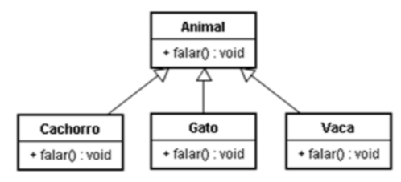

# Curso de Fundamentos de Java.

## Herança e Polimorfismo

### 1. Herança

- A herança é um mecanismo que permite que uma classe possa herdar o comportamento de outra classe, ao mesmo tempo em que novos comportamentos podem ser estabelecidos;

- A relação de  herança é dada entre classes;

- Uma classe é chamada de superclasse e a outra de subclasse. Subclasse é a classe que herda da superclasse;

- A Subclasse herda o comportamento da superclasse e também pode estabelecer outros comportamentos para ela;

- A vantagem da herança é agrupar coisas comuns para poder reaproveitar código.

#### 1.1 Programando a herança

#### Exemplo:

- Classe Telefone;
- Classe orelhão e celular que herdam de telefone;
- Relação "é um". A subclasse é sempre do tipo da superclasse (classe mãe);

#### Sintaxe:

```java

public class Celular extends Telefone {
	...
}
```

---

```java
public class Orelhao extends Telefone {
	...
}

```

- A palavra _extends_ é a maneira de se dizer que celular e orelhão herdam de telefone, seguido do nome da superclasse.

#### 1.2 Herança da Classe _Object_

- O Java permite apenas herança simples e não múltipla;

- Toda classe em Java herda de apenas uma superclasse;

- Se não for utilizada a palavra chave _extends_ automaticamente a classe definida herda de _Object_;

- _Object_ é a superclasse de último nível de todas as classes em Java. Todas as classes herdam de _Object_, direta ou indiretamente.

#### 1.3 O modificador _protected_

- Atributos e métodos declarados com o modificador protected podem ser acessados pelas suas subclasses, conforme abaixo;

```java

class Telefone {
	protected String numero;
	...
}
```

```java

class Celular extends Telefone {

	public void adicionarDDD(String ddd) {
		String n = ddd + this.numero;
	}

}
```

---

#### 1.4 Sobrescrita de métodos

- Técnica também conhecida como overriding;

- Quando uma classe herda de outra, ela pode redefinir métodos da superclasse, isto é, sobrescrever métodos: 
	1. **Os métodos sobrescritos substituem os métodos da superclasse**;
	2. A assinatura do método sobrescrito deve ser a 
mesma do método original;#### Exemplo:


#### Exemplo 01:

```java

class Telefone {
	public void telefonar(){
		//código para telefonar
	}

}
```

```java

class Orelhao extends Telefone {
	public void telefonar(){
		//código para telefonar do orelhão
	}

}
```

---

- As duas classe tem o método _telefonar()_. Está acontecendo a sobrescrita do método _telefonar()_ em Orelhao.

- No exemplo abaixo, como o método foi sobrescrito, é chamado o método _telefonar()_ da subclasse:

```java
Orelhao o = new Orelhao();
o.telefonar();
```


#### Exemplo 02:

- A classe Orelhao agora tem um método _telefonar()_ que recebe um _int_ como parâmetro:

```java

class Telefone {
	public void telefonar(){
		//código para telefonar
	}

}
```

```java

class Orelhao extends Telefone {
	public void telefonar(int numero){
		//código para telefonar do orelhão
	}

}
```

```java
Orelhao o = new Orelhao();
o.telefonar();
```

- Acima não há sobrescrita de método. Métodos sobrescritos devem ter a mesma assinatura (tipo de retorno, nome do método e parâmetros). O método evocado é o _telefonar()_ da superclasse, ou seja, Telefone. Aqui não houve sobrescrita de métodos.

#### 1.4.1 Sobrescrita de métodos da classe _Object_

- Método **toString()**

	1. As classes podem sobrescrever este método 
para mostrarem uma mensagem que as 
representem;
	2. O método System.out.println(), por exemplo, 
utiliza este método;

- Método **equals(Object)**
	1. É a forma que o Java tem de comparar objetos pelo seu conteúdo ao invés de comparar as referências (como acontece ao usarmos "==").

#### 1.4.2 Usando o _super_

- O método que foi sobrescrito pode ser acessado pelo método que o sobrescreveu através da palavra-chave super;

#### Exemplo:

```java

class Orelhao extends Telefone {
	public void telefonar(){
		super.telefonar();
	}

}
```

### 2. Polimorfismo

- É a capacidade que um método tem de agir de diferentes formas, dependendo do objeto sobre o qual está sendo chamado;

- Quando ocorre a chamada de um método, a JVM decide qual método invocar dependendo do objeto instanciado na memória;

#### Exemplo:

- De acordo com as classes definidas abaixo, nas quais três herdam de **Animal** : **Cachorro**, **Gato** e **Vaca**.



- As três classes sobrescrevem o método falar, implementando o método _falar()_ ao seu modo:

```java
class Animal {
	public void falar(){
	}
}
```

```java
class Cachorro extends Animal {
	public void falar(){
		System.out.println("Au");
	}
}
```

```java
class Gato extends Animal {
	public void falar(){
		System.out.println("Miau");
	}
}
```

```java
class Vaca extends Animal {
	public void falar(){
		System.out.println("Mu");
	}
}
```

#### Exemplo 01 de execução de código:

```java

Animal a = new Cachorro();
a.falar();

```
> Resultado : "Au".

```java

Animal a = new Gato();
a.falar();

```
> Resultado : "Miau".

```java

Animal a = new Vaca();
a.falar();

```
> Resultado : "Mu".

- **O método invocado é determinado pelo tipo do objeto que está armazenado (instanciado) na memória**, por isso os resultados diferenciados.

#### Exemplo 02 de execução de código:

```java

Cachorro c = new Cachorro();
Animal a = (Animal) c; // Fazendo um casting de Cachorro para Animal

a.falar

```
> Resultado: "Au".

- Fazendo um casting de Cachorro para Animal e atribuindo à variável _a_.

- Mesmo que se faça isso, o objeto na memória continua sendo do tipo cachorro.

- O que mudou foi somente a forma como o objeto é referenciado na memória e não o objeto em si;

- Ou seja, a forma como o objeto é referenciado não influencia na decisão sobre qual método será invocado.

#### Exemplo 03 de execução de código:

- Definindo um novo método na classe Cachorro:

```java
class Cachorro extends Animal {
	public void falar(){
		System.out.println("Au");
	}

	public void morder(){
		System.out.println("GRRRR");
	}
}
```

1. Criando objeto do tipo Cachorro:
```java
Animal a = new Cachorro();
a.falar();

```
> Resultado: "Au".

2. Método é inexistente para a variável que está sendo utilizada para referenciar o objeto do tipo Cachorro. A variável é do tipo Animal, e para a classe Animal não há o método definido _morder()_:

```java
Animal a = new Cachorro();
a.morder();

```
> Resultado: método inexistente.

3. Fazendo o casting de Animal para Cachorro, o código funciona. Pois a variável (tipo Cachorro) que referencia o objeto (Cachorro) tem o método que foi evocado.

```java
Animal a = new Cachorro();
Cachorro c = (Cachorro) a;
c.morder();

```
> Resultado: OK!

- Em resumo: o tipo pelo qual o objeto é referenciado determina quais métodos e-ou atributos podem ser evocados.

#### 2.1 O operador _instanceOf_

- Utilizado para verificar se um objeto pertence à determinada classe.

#### Exemplo:

```java
Animal a = new Cachorro();

a instanceof Cachorro;
```

> Resultado: true.
a é uma instancia de Cachorro.

```java
a instanceof Animal;
```

> Resultado: true.

- Pois o objeto é uma instancia da superclasse, da qual Cachorro herda.

```java
a instanceof Gato;
```

> Resultado: false.

- Pois o obejeto não é um Gato. 

```java
a instanceof Object;
```

> Resultado: true.

- Pois em último nivel todas as classe em java herdam de _Object_.

- O operador _instanceOf_ normalmente é utilizado antes de realizar um casting'para garantir que a operação é válida.


